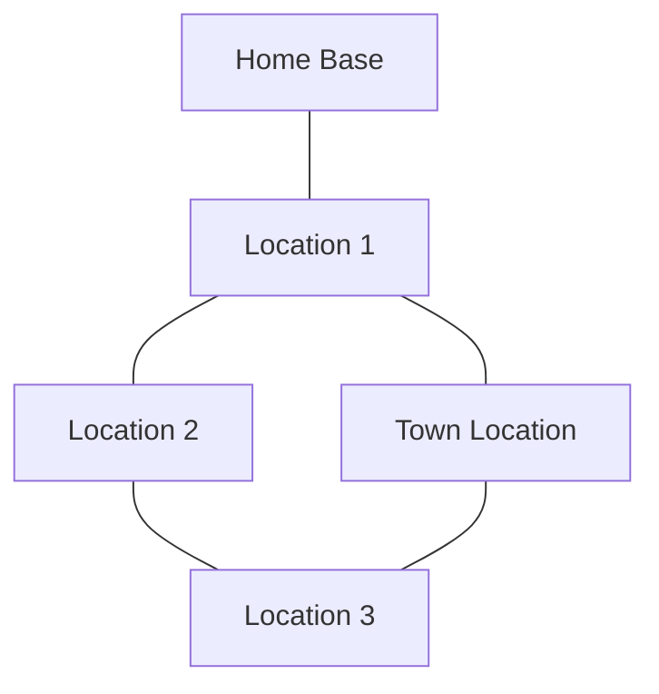

# Locations System

The world is structured as a connected graph of locations that pets can travel between.

## World Structure

Locations are nodes connected by edges. Travel follows edges between connected locations.



Actual world graph is defined in game data.

## Location Properties

Each location has:

| Property | Description |
|----------|-------------|
| id | Unique identifier |
| name | Display name |
| type | Location type |
| connections | Array of connected location IDs |
| levelRange | Min/max encounter levels |
| requirements | Unlock conditions |
| facilities | Available buildings/features |
| forageTable | Reference to forage data (see [Exploration](./exploration.md)) |
| encounterTable | Reference to encounter data (see [Exploration](./exploration.md)) |
| npcs | Array of NPC IDs present (see [Quests](./quests.md)) |

## Location Types

### Home

Starting location with basic pet care facilities.

| Characteristic | Description |
|----------------|-------------|
| Safety | No encounters |
| Access | Always accessible |
| Facilities | Basic care, storage |

### Town

Social hubs with shops and services.

| Characteristic | Description |
|----------------|-------------|
| Safety | No wild encounters |
| NPCs | Merchants, trainers, quest givers (see [Quests](./quests.md)) |
| Facilities | Shops, training (see [Training](./training.md)), services |

### Wild

Exploration areas with foraging and encounters.

| Characteristic | Description |
|----------------|-------------|
| Activities | Foraging, scouting, battles (see [Exploration](./exploration.md)) |
| Danger | Wild encounters possible |
| Requirements | May have skill/stage requirements |

### Dungeon

Challenge areas with difficult content.

| Characteristic | Description |
|----------------|-------------|
| Difficulty | High-level encounters |
| Rewards | Rare loot, quest objectives |
| Requirements | Typically late-game access |

## Travel System

### Travel Cost

Travel consumes energy per edge traversed. See [Energy](./energy.md) for energy mechanics.

| Factor | Effect |
|--------|--------|
| Base cost | Per edge traveled |
| Terrain modifier | Some edges cost more |
| Multi-hop | Accumulates per edge |

### Path Finding

When traveling multiple edges:
```
totalCost = sum of (baseCost × terrainModifier) for each edge
```

### Travel Restrictions

| Restriction | Check |
|-------------|-------|
| Growth stage | Some locations locked by stage (see [Growth](./growth.md)) |
| Quest progress | Some require quest completion (see [Quests](./quests.md)) |
| Skill level | Some require minimum skills (see [Skills](./skills.md)) |
| Energy | Cannot travel with insufficient energy |
| Sleep | Cannot travel while sleeping (see [Sleep](./sleep.md)) |

## Location Facilities

### Home Facilities

| Facility | Function |
|----------|----------|
| Rest Area | Sleep, energy recovery (see [Sleep](./sleep.md)) |
| Food Station | Feed pet (see [Care](./care.md)) |
| Water Station | Hydrate pet (see [Care](./care.md)) |
| Play Area | Happiness activities (see [Care](./care.md)) |
| Storage | Store items (see [Items](./items.md)) |

### Town Facilities

| Facility | Function |
|----------|----------|
| Shop | Buy and sell items |
| Trainer | Train battle stats (see [Training](./training.md)) |
| Inn | Rest and recover |
| Quest Board | Accept quests (see [Quests](./quests.md)) |

### Wild Facilities

| Facility | Function |
|----------|----------|
| Rest Point | Partial recovery |
| Forage Zone | Gather items (see [Exploration](./exploration.md)) |
| Battle Area | Find encounters (see [Battle](./battle.md)) |

## Discovery System

Hidden locations can be discovered through:

| Method | Description |
|--------|-------------|
| High Scouting | Skill check during exploration (see [Skills](./skills.md)) |
| Quest Completion | Reveal through quest rewards (see [Quests](./quests.md)) |
| Random Events | Exploration event outcomes (see [Exploration](./exploration.md)) |
| NPC Hints | Dialogue options |

Discovered locations are permanently added to the player's map.

## Location Requirements

### Requirement Types

| Type | Description |
|------|-------------|
| stage | Minimum growth stage (see [Growth](./growth.md)) |
| quest | Must complete specific quest (see [Quests](./quests.md)) |
| skill | Minimum skill level (see [Skills](./skills.md)) |
| discovery | Must have discovered location |

### Requirement Evaluation

```
canAccess = all requirements met
```

If not met, location appears locked on map.
