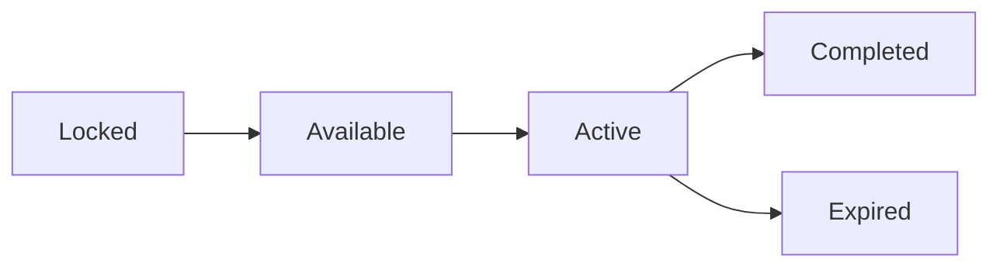

# Quests System

Quests provide structured goals, story progression, and rewards through NPC interactions.

## Quest Structure

Each quest contains:

| Property | Description |
|----------|-------------|
| id | Unique identifier |
| name | Display name |
| description | Quest details and lore |
| giver | NPC ID who assigns quest |
| requirements | Prerequisites to start |
| objectives | Tasks to complete |
| rewards | Items, currency, unlocks |
| chain | Next quest ID in series (optional) |
| startLocationId | Location where quest can be accepted (optional) |
| completeLocationId | Location where quest can be turned in (optional) |

## Quest Types

| Type | Description |
|------|-------------|
| Main | Story progression quests |
| Side | Optional quests with rewards |
| Daily | Reset each day at midnight, auto-activated |
| Weekly | Reset each Monday at midnight, auto-activated |
| Timed | Fixed duration from acceptance, can expire |
| Tutorial | One-time learning quests |
| Hidden | Discovered through exploration |

## Quest States



| State | Description |
|-------|-------------|
| Locked | Requirements not met |
| Available | Can be accepted |
| Active | In progress |
| Completed | Finished, rewards claimed |
| Expired | Timed quest not completed before deadline |

Note: Daily and weekly quests never enter Expired state - they are reset on their schedule.

## NPCs

### NPC Properties

| Property | Description |
|----------|-------------|
| id | Unique identifier |
| name | Display name |
| location | Location ID where found |
| role | Merchant, Trainer, Quest Giver, etc |
| dialogue | Dialogue tree reference |
| quests | Array of quest IDs offered |
| shop | Shop inventory (if merchant) |

### NPC Roles

| Role | Function |
|------|----------|
| Quest Giver | Offers quests, advances story |
| Merchant | Sells items |
| Trainer | Provides training services |
| Guide | Tutorial and hints |
| Lore | Background information |

### Dialogue System

NPCs have dialogue trees with:

| Dialogue Type | Trigger |
|---------------|---------|
| Greeting | First interaction |
| Standard | Returning interactions |
| Quest | Quest-specific dialogue |
| Shop | If merchant role |
| Farewell | Ending conversation |

Dialogue options may unlock based on:
- Quest progress
- Pet growth stage
- Player skill levels
- Previous dialogue choices

## Quest Requirements

### Requirement Types

| Type | Description |
|------|-------------|
| quest | Must complete another quest first |
| stage | Pet must reach growth stage |
| skill | Minimum skill level required |
| item | Must possess certain item |
| location | Must have discovered location |
| battle | Must have won X battles |

### Requirement Evaluation

```
canStart = all requirements evaluate to true
```

## Quest Objectives

### Objective Types

| Type | Description |
|------|-------------|
| Collect | Gather specific items |
| Defeat | Win battles against targets |
| Visit | Travel to location |
| Talk | Speak to NPC |
| Explore | Complete exploration activities |
| Train | Complete training sessions |
| Care | Maintain care stats at threshold |

### Objective Properties

| Property | Description |
|----------|-------------|
| type | Objective type |
| target | What to collect/defeat/visit |
| quantity | How many required |
| progress | Current count |

### Objective Structure

Objectives may be:
- Sequential (complete in order)
- Parallel (complete any order)
- Optional (bonus rewards)

## Rewards

### Reward Types

| Type | Description |
|------|-------------|
| Currency | In-game money |
| Item | Specific items |
| XP | Skill experience |
| Unlock | New location, species, feature |
| Equipment | Durability items |

### Reward Properties

| Property | Description |
|----------|-------------|
| type | Reward type |
| target | What is rewarded (item ID, location ID, etc) |
| quantity | Amount given |

## Quest Chains

Related quests form chains where completing one unlocks the next.

| Chain Property | Description |
|----------------|-------------|
| chain | Next quest ID |
| chainPrevious | Previous quest ID |

## Daily Quests

| Property | Description |
|----------|-------------|
| Reset | Midnight local time |
| Auto-activate | Start in Active state on reset |
| Expiration | Shows time until next reset |
| No fail state | Reset instead of failing on expiration |

Daily quests are automatically activated at midnight and show a countdown to the next reset.

## Weekly Quests

| Property | Description |
|----------|-------------|
| Reset | Monday midnight local time |
| Auto-activate | Start in Active state on reset |
| Expiration | Shows time until next Monday |
| No fail state | Reset instead of failing on expiration |

Weekly quests have larger objectives and better rewards than dailies.

## Timed Quests

| Property | Description |
|----------|-------------|
| Duration | Fixed time limit from quest start |
| Expiration | Shows countdown from acceptance |
| Fail state | Moves to Expired category on timeout |

Timed quests have a fixed duration and must be completed before time runs out.
Unlike daily/weekly quests, they enter the Expired state if not completed in time.

## Location-Based Quests

Quests can be restricted to specific locations for starting and/or completing:

| Property | Description |
|----------|-------------|
| startLocationId | Player must be at this location to accept the quest |
| completeLocationId | Player must be at this location to turn in the quest |

### Location Restriction Combinations

| Start Location | Complete Location | Behavior |
|----------------|-------------------|----------|
| Not set | Not set | Quest can be accepted and completed anywhere |
| Set | Not set | Quest must be accepted at specific location, can be completed anywhere |
| Not set | Set | Quest can be accepted anywhere, must be turned in at specific location |
| Set | Set | Quest must be accepted at one location, turned in at another (or same) |

This simulates location-specific quest boards where players must physically travel to accept quests and return to turn them in.

## Hidden Quests

Discovered through:
- Exploring hidden locations
- High skill checks during activities
- Specific dialogue choices
- Random events

Hidden quests often have unique rewards.

## Quest Journal

UI shows:
- Active quests (with expiration timers for daily/weekly/timed)
- Available quests
- Completed quests (history)
- Expired quests (timed quests that weren't completed)
- Current objectives and progress