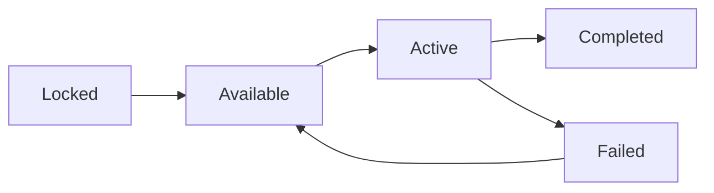

# Quests System

Quests provide structured goals, story progression, and rewards through NPC interactions.

## Quest Structure

Each quest contains:

| Property | Description |
|----------|-------------|
| id | Unique identifier |
| name | Display name |
| description | Quest details and lore |
| giver | NPC ID who assigns quest |
| requirements | Prerequisites to start |
| objectives | Tasks to complete |
| rewards | Items, currency, unlocks |
| chain | Next quest ID in series (optional) |

## Quest Types

| Type | Description |
|------|-------------|
| Main | Story progression quests |
| Side | Optional quests with rewards |
| Daily | Reset each day, repeatable |
| Tutorial | One-time learning quests |
| Hidden | Discovered through exploration |

## Quest States



| State | Description |
|-------|-------------|
| Locked | Requirements not met |
| Available | Can be accepted |
| Active | In progress |
| Completed | Finished, rewards claimed |
| Failed | Objective failed, can retry |

## NPCs

### NPC Properties

| Property | Description |
|----------|-------------|
| id | Unique identifier |
| name | Display name |
| location | Location ID where found |
| role | Merchant, Trainer, Quest Giver, etc |
| dialogue | Dialogue tree reference |
| quests | Array of quest IDs offered |
| shop | Shop inventory (if merchant) |

### NPC Roles

| Role | Function |
|------|----------|
| Quest Giver | Offers quests, advances story |
| Merchant | Sells items |
| Trainer | Provides training services |
| Guide | Tutorial and hints |
| Lore | Background information |

### Dialogue System

NPCs have dialogue trees with:

| Dialogue Type | Trigger |
|---------------|---------|
| Greeting | First interaction |
| Standard | Returning interactions |
| Quest | Quest-specific dialogue |
| Shop | If merchant role |
| Farewell | Ending conversation |

Dialogue options may unlock based on:
- Quest progress
- Pet growth stage
- Player skill levels
- Previous dialogue choices

## Quest Requirements

### Requirement Types

| Type | Description |
|------|-------------|
| quest | Must complete another quest first |
| stage | Pet must reach growth stage |
| skill | Minimum skill level required |
| item | Must possess certain item |
| location | Must have discovered location |
| battle | Must have won X battles |

### Requirement Evaluation

```
canStart = all requirements evaluate to true
```

## Quest Objectives

### Objective Types

| Type | Description |
|------|-------------|
| Collect | Gather specific items |
| Defeat | Win battles against targets |
| Visit | Travel to location |
| Talk | Speak to NPC |
| Explore | Complete exploration activities |
| Train | Complete training sessions |
| Care | Maintain care stats at threshold |

### Objective Properties

| Property | Description |
|----------|-------------|
| type | Objective type |
| target | What to collect/defeat/visit |
| quantity | How many required |
| progress | Current count |

### Objective Structure

Objectives may be:
- Sequential (complete in order)
- Parallel (complete any order)
- Optional (bonus rewards)

## Rewards

### Reward Types

| Type | Description |
|------|-------------|
| Currency | In-game money |
| Item | Specific items |
| XP | Skill experience |
| Unlock | New location, species, feature |
| Equipment | Durability items |

### Reward Properties

| Property | Description |
|----------|-------------|
| type | Reward type |
| target | What is rewarded (item ID, location ID, etc) |
| quantity | Amount given |

## Quest Chains

Related quests form chains where completing one unlocks the next.

| Chain Property | Description |
|----------------|-------------|
| chain | Next quest ID |
| chainPrevious | Previous quest ID |

## Daily Quests

| Property | Description |
|----------|-------------|
| Reset | Midnight local time |
| Limit | Maximum active daily quests |
| Refresh | New dailies available each reset |

## Hidden Quests

Discovered through:
- Exploring hidden locations
- High skill checks during activities
- Specific dialogue choices
- Random events

Hidden quests often have unique rewards.

## Quest Journal

UI shows:
- Active quests (with limits)
- Available quests
- Completed quests (history)
- Current objectives and progress